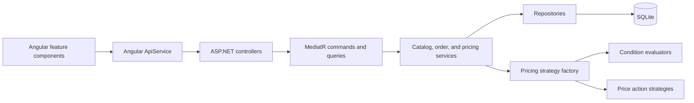

# FruitShopDemo

FruitShopDemo is a full-stack ordering and catalog-management application for fruit sold by weight or count. It includes an Angular client, an ASP.NET Core API, SQLite persistence, and configurable pricing rules.

## Technology

- **Client:** Angular 21, TypeScript, RxJS, and standalone lazy-loaded feature components.
- **API:** ASP.NET Core on .NET 10, MediatR, FluentValidation, AutoMapper, and Swagger.
- **Persistence:** EF Core with SQLite and database migrations.
- **Tests:** .NET API unit tests and Angular Vitest component tests.

## Running Locally

- **Client:** [http://localhost:4200/](http://localhost:4200/)
- **API Swagger:** [http://localhost:5173/swagger/index.html](http://localhost:5173/swagger/index.html)

Start the API from the repository root:

```powershell
dotnet run --project .\FruitShop.Api\FruitShop.Api.csproj
```

On first startup, the API applies migrations and seeds its demo catalog and price rules.

Start the client in a second terminal:

```powershell
Set-Location .\FruitShop.Client
npm install
npm start
```

The Angular proxy forwards `/api` requests to the local API.

Run the API tests with:

```powershell
dotnet test .\FruitShop.Api.Tests\FruitShop.Api.Tests.csproj -c Release
```

Run Angular tests from `FruitShop.Client` with:

```powershell
npm test -- --watch=false
```

## Design Decisions

### Server-authoritative pricing

The client requests a price preview with product variant, quantity, customer tier, and cart subtotal. The API evaluates pricing rules and returns both the applied unit price and a human-readable reason. The submitted order stores the applied unit price, line total, and price-change reason, so a later price or rule change does not rewrite historical orders.

### Product and variant modeling

A `Product` represents the fruit name, while a `ProductVariant` carries the sellable SKU, unit of measure, conversion factor, base price, and active status. This keeps an apple sold by kilogram distinct from a packaged count-based apple without duplicating the product itself.

### Data-driven rules

Price rules are persisted rather than hard-coded. A rule has a priority, optional customer-tier and variant targets, conditions, actions, active status, and a stackability flag. Existing rule conditions support quantity, cart subtotal, customer tier, and order date. Existing actions support percentage discounts, fixed amount-off discounts, and price overrides.

The pricing service processes active rules in descending priority. All conditions in one rule must pass. Its actions update a running price in order, and a non-stackable matching rule ends evaluation. Each action can calculate from the original base price or the running total, making discount composition explicit.

### Clear application boundaries

The Angular client is divided into order, catalog administration, product-rule management, and shared UI features. Its `ApiService` centralizes the HTTP contract. The API keeps controllers thin, delegates work to MediatR requests and feature handlers, and uses application services and repositories for business and data access concerns.



## Patterns Used

### Vertical slices with command/query separation

API behavior is grouped by feature under `Features/Products`, `Features/Orders`, and `Features/AdminCatalog`. Controllers send MediatR commands for state changes and queries for reads. This keeps each use case close to its request and response types while preventing controller logic from becoming the application layer.

### Repository pattern

`IProductRepository`, `IOrderRepository`, and `IPriceRuleRepository` isolate EF Core queries and persistence from order processing and catalog logic. This makes services focused on business rules and allows the persistence implementation to change with a smaller blast radius.

### Strategy pattern for pricing

Every price action implements `IPriceActionStrategy`; the supplied implementations are percentage-off, amount-off, and override-price. Every condition type implements `IConditionEvaluator`; the supplied evaluators handle quantity, date, customer tier, and cart subtotal. Each implementation declares the action or attribute it handles.

The `PricingStrategyFactory` selects the appropriate implementation from dependency injection. This avoids an expanding conditional block in the pricing service and makes new pricing behavior additive.

### Factory and dependency injection

The pricing factory receives all registered strategies and evaluators. The application composition root registers them in `Program.cs`, so the pricing service depends on interfaces rather than concrete pricing types. This supports focused testing and explicit application wiring.

## Extending the Shop

### Add a new fruit

1. Create the product through the catalog administration UI or `POST /api/admin/products`.
2. Add one or more variants with `POST /api/admin/products/{productId}/variants`, supplying a unique SKU, existing unit-of-measure code, conversion factor, and base price.
3. Enable or disable variants through the catalog instead of deleting them, preserving order history.
4. Add a database migration and seed data only when the new fruit must ship as default demo content. Adding a fruit during normal operation does not require a deployment.

The current API exposes existing units of measure to catalog administration but does not include an endpoint to create a new unit. To introduce a new unit type, add the data through a migration or seeding path, then expose a validated administration endpoint if runtime management is required.

### Add or change a discount without code

1. Create a price rule through `POST /api/admin/price-rules` or the administration UI.
2. Set priority and whether matching rules can stack.
3. Make the rule global or target product variants and customer tiers.
4. Add supported conditions and one or more actions.
5. Verify the preview endpoint, `POST /api/orders/calculate-item`, and submit a test order.

For example, a VIP quantity promotion can target the `VIP` tier, require a quantity threshold, and apply a percentage discount. A date-limited promotion can use an `orderdate` condition with a comparison or an inclusive `BETWEEN` range in `yyyy-MM-dd AND yyyy-MM-dd` format.

### Add a new action type

For a new pricing effect, such as a buy-one-get-one calculation:

1. Add an `ActionType` enum value.
2. Implement `IPriceActionStrategy`, including calculation and a concise description for order audit history.
3. Register the strategy in `Program.cs`.
4. Update rule validation, the Angular action type and administration form, and API contract tests.
5. Add unit tests for the strategy alone and integration-style tests for priority, stackability, and calculation-base behavior.

### Add a new condition type

For a new rule input, such as delivery zone or customer lifetime spend:

1. Add the value to `PricingContext` and populate it in the order-item calculation flow.
2. Implement `IConditionEvaluator` for the new attribute and register it in `Program.cs`.
3. Extend `PriceRuleConditionSchema` so the attribute, operators, and stored value format are validated consistently.
4. Update the administration UI and its TypeScript contract, then add validation and pricing tests.

This preserves the existing rule pipeline: the factory discovers the new evaluator, and the pricing service can apply it without needing a new branch.

## Main Routes

- `/` creates a new order and previews prices.
- `/orders` lists submitted orders.
- `/admin` manages products, variants, and price rules.
- `/product-variant-price-rules` assigns non-global rules to product variants.

## API Endpoints

- `GET /api/products` lists active products and variants.
- `POST /api/orders/calculate-item` previews the calculated price for one item.
- `POST /api/orders/submit` creates and submits an order.
- `GET /api/orders` and `GET /api/orders/{id}` retrieve order history.
- `GET /api/admin/catalog` retrieves catalog administration data.
- `POST /api/admin/products` and `POST /api/admin/products/{productId}/variants` add catalog data.
- `POST /api/admin/price-rules` creates configurable rules.
- `PUT` and `DELETE /api/admin/variants/{variantId}/price-rules/{priceRuleId}` manage per-variant rule assignment.